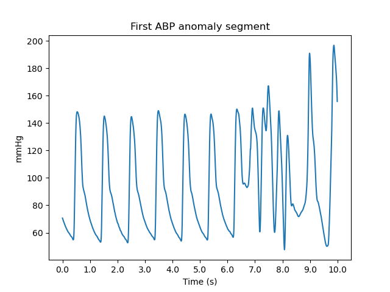

# Creathon HDF5 Utils

This repository contains a set of utilities for working with HDF5 files.

Raw signals are stored in HDF5 files. These can be loaded using the functions provided in the `lib/funcs.py` module. When a signal is annotated, it is split into segments of 10 seconds. Each segment is given a label based on whether an anomaly is present in the segment. The anomaly information is stored in a separate XML file with the same name as the HDF5 file, but with an `.artf` extension. See the provided tools for more information on how to work with the data at a low level.

## Installation (Linux/MacOS)
**Python 3.9+ is required**

1. Clone and enter the repository:
```
git clone https://github.com/MQ37/creathon.git
cd creathon
```
2. Create and activate Python virtualenv:
```
python3 -m venv venv
source venv/bin/activate
```
3. Install the requirements:
```bash
pip install -r requirements.txt
```

## Installation (Windows)
**Python 3.9+ is required**

1. Clone and enter the repository:
```
git clone https://github.com/MQ37/creathon.git
cd creathon
```

2. Create and activate Python virtual environment:
```
python -m venv venv
venv\Scripts\activate
```

3. Install the requirements:
```
pip install -r requirements.txt
```

## Usage
**Python virtualenv must be activated**

Run the desired tool/script with the required arguments (these can be found in the help message using the `-h` flag). For example, to use the `info` tool, run:
```bash
python3 info.py -f <path_to_hdf5_file>
# example
python3 info.py -f ./data/TBI_003.hdf5
```

To export ABP/ICP 10s segments from an HDF5 file, use the provided extract.py script. The segments will be exported as NumPy text files named `{signal}_{start_idx}_{is_anomalous}.txt` where `0` indicates a normal and `1` indicates an anomalous segment.
```
# ABP signal
python3 extract.py -f ./data/TBI_003.hdf5 -o ./export/ -s abp
# ICP signal
python3 extract.py -f ./data/TBI_003.hdf5 -o ./export/ -s icp
```
To export the same number of normal segments (not marked as anomalies) as anomalous segments, use the `-sn` switch. For example, if there are 704 marked anomalies in the ABP signal of this file, then only the first 704 normal segments will be exported along with the anomalous segments (without this switch, all normal segments are exported).
```
# ABP signal same number of segments
python3 extract.py -f ./data/TBI_003.hdf5 -o ./export/ -s abp -sn
```
To print all anomalies present in the HDF5 file with their signal index and datetime, use the `anomalies.py` tool. 
```
# ABP
python3 anomalies.py -f ./data/TBI_003.hdf5 -s abp
# ICP
python3 anomalies.py -f ./data/TBI_003.hdf5 -s icp
```

## Tools

- `info.py`: Displays information about the HDF5 file.
- `extract.py`: Extracts data from the HDF5 file and saves it as a NumPy TXT file.
- `anomalies.py`: Displays information about anomalies present in the HDF5 file. 

## How to load segments

You can use two classes from `lib.loader` to work with the HDF5 file ABP and ICP signals. `SingleFileExtractor` to extract signal segments from a single file (and the corresponding `.artf` file) and `FolderExtractor` to extract all segments from all files in a specified directory. Be sure to go through `example.py` to see how to use those two classes. When you run `example.py`, you should see the following plot:


## ARTF File Format

The ARTF file, stored in XML format, contains information about anomalies present in the corresponding HDF5 file. It has the following structure:

* **`<ICMArtefacts>`**: The root element encompassing all anomaly information.
* **`<Global>`**: Contains anomalies that apply to all signals in the HDF5 file.
    * **`<Artefact>`**:  Defines an anomaly with `StartTime` and `EndTime` attributes specifying its duration.
* **`<SignalGroup>`**:  Contains anomalies specific to a particular signal, identified by the `Name` attribute.
    * **`<Artefact>`**: Similar to the global anomaly, defines an anomaly with `StartTime` and `EndTime` attributes.
* **`<Info>`**:  Provides metadata about the ARTF file.
    * **`HDF5Filename`**:  The name of the associated HDF5 file.
    * **`UserID`**: (Optional) Identifier of the user who annotated the anomalies.

**Example**

```xml
<?xml version="1.0" ?>
<ICMArtefacts>

    <Global>
        <Artefact StartTime="01/01/1970 00:00:05.000"
                  EndTime="01/01/1970 00:00:15.000"/>
    </Global>

    <SignalGroup Name="icp">
        <Artefact StartTime="01/01/1970 00:00:15.000"
                  EndTime="01/01/1970 00:00:25.000"/>
    </SignalGroup>

    <SignalGroup Name="abp">
        <Artefact StartTime="01/01/1970 00:00:25.000"
                  EndTime="01/01/1970 00:00:35.000"/>
        <Artefact StartTime="01/01/1970 00:00:35.000"
                  EndTime="01/01/1970 00:00:45.000"/>
    </SignalGroup>

    <Info HDF5Filename="soubor.hdf5" UserID="uzivatel1"/>

</ICMArtefacts>
``` 

## Notes
**Be sure to read this**

Note that the ABP wave signal is sometimes stored in HDF5 files as `waves.art` instead of `waves.abp`. 


